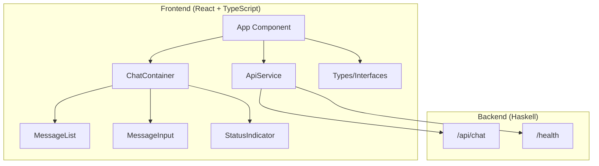

# Design Document

## Overview

This document outlines the design for a React-based Web UI Frontend that interfaces with the existing Haskell AI chatbot backend. The frontend will provide a modern, responsive chat interface using TypeScript, React 19, Vite with SWC, and pnpm for package management.

The design follows modern React patterns with functional components, hooks for state management, and a clean component architecture that separates concerns between UI presentation, API communication, and state management.

## Architecture

### High-Level Architecture



### Component Hierarchy

- **App**: Root component managing global state and API service
- **ChatContainer**: Main chat interface container
  - **StatusIndicator**: Shows connection status and typing indicators
  - **MessageList**: Displays conversation history
    - **Message**: Individual message component (user/assistant)
  - **MessageInput**: Input field and send button
- **ApiService**: Handles all backend communication
- **Types**: TypeScript interfaces and type definitions

### Technology Stack

- **React 19**: Latest React with concurrent features
- **TypeScript**: Type safety and better developer experience
- **Vite**: Fast build tool with SWC for TypeScript compilation
- **pnpm**: Efficient package manager
- **CSS Modules/Styled Components**: Component-scoped styling
- **Fetch API**: Native HTTP client for API calls

## Components and Interfaces

### Core Types and Interfaces

```typescript
// API Types matching backend schema
interface ChatInput {
  inputMessage: string;
  sessionId: string | null;
}

interface ChatOutput {
  outputMessage: string;
  outputSessionId: string;
}

interface HealthInfo {
  status: string;
  version: string;
  uptime: number;
  timestamp: string;
}

// Frontend-specific types
interface Message {
  id: string;
  content: string;
  role: 'user' | 'assistant';
  timestamp: Date;
}

interface ChatState {
  messages: Message[];
  sessionId: string | null;
  isLoading: boolean;
  isConnected: boolean;
  error: string | null;
}
```

### Component Specifications

#### App Component
- **Purpose**: Root component managing global application state
- **State**: Chat state, connection status, error handling
- **Responsibilities**: 
  - Initialize API service
  - Manage session state
  - Handle global error boundaries
  - Provide context to child components

#### ChatContainer Component
- **Purpose**: Main chat interface layout and orchestration
- **Props**: Chat state and handlers from App
- **Responsibilities**:
  - Layout management for chat interface
  - Coordinate between MessageList and MessageInput
  - Handle message sending logic
  - Manage loading states

#### MessageList Component
- **Purpose**: Display conversation history
- **Props**: Array of messages, loading state
- **Responsibilities**:
  - Render message history in chronological order
  - Auto-scroll to latest messages
  - Show typing indicators
  - Handle empty state

#### Message Component
- **Purpose**: Individual message display
- **Props**: Message data (content, role, timestamp)
- **Responsibilities**:
  - Render message content with appropriate styling
  - Distinguish between user and assistant messages
  - Display timestamps
  - Handle message formatting

#### MessageInput Component
- **Purpose**: User input interface
- **Props**: Send handler, loading state
- **Responsibilities**:
  - Text input with send button
  - Handle Enter key submission
  - Validate input (non-empty)
  - Disable during loading states

#### StatusIndicator Component
- **Purpose**: Show connection and activity status
- **Props**: Connection status, loading state
- **Responsibilities**:
  - Display connection status (connected/disconnected)
  - Show typing indicators
  - Display error states
  - Provide visual feedback

### API Service Design

```typescript
class ApiService {
  private baseUrl: string;
  
  constructor(baseUrl: string = 'http://localhost:8080') {
    this.baseUrl = baseUrl;
  }
  
  async sendMessage(input: ChatInput): Promise<ChatOutput> {
    // POST to /api/chat with proper error handling
  }
  
  async checkHealth(): Promise<HealthInfo> {
    // GET to /health with timeout handling
  }
}
```

## Data Models

### Message Flow

1. **User Input**: User types message and clicks send
2. **State Update**: Add user message to local state immediately
3. **API Call**: Send ChatInput to backend `/api/chat`
4. **Response Handling**: Process ChatOutput and update state
5. **UI Update**: Display assistant response and update session

### State Management

Using React's built-in state management with hooks:

- **useState**: For component-local state
- **useEffect**: For side effects (API calls, auto-scroll)
- **useCallback**: For memoized event handlers
- **useMemo**: For computed values (filtered messages, etc.)

### Session Management

- Store `sessionId` in component state (not localStorage for security)
- Start with `sessionId: null` for new conversations
- Use returned `sessionId` for subsequent messages
- Reset session when clearing conversation

## Error Handling

### API Error Handling

```typescript
enum ErrorType {
  NETWORK_ERROR = 'NETWORK_ERROR',
  SERVER_ERROR = 'SERVER_ERROR',
  VALIDATION_ERROR = 'VALIDATION_ERROR',
  TIMEOUT_ERROR = 'TIMEOUT_ERROR'
}

interface ApiError {
  type: ErrorType;
  message: string;
  statusCode?: number;
}
```

### Error Recovery Strategies

1. **Network Errors**: Show retry button, auto-retry with exponential backoff
2. **Server Errors**: Display user-friendly error messages
3. **Validation Errors**: Highlight input issues
4. **Timeout Errors**: Allow manual retry

### User Experience During Errors

- Non-blocking error messages (toast/banner style)
- Graceful degradation (disable send button during errors)
- Clear error messages with actionable steps
- Maintain conversation history during errors

## Testing Strategy

### Unit Testing

- **Components**: Test rendering, props handling, user interactions
- **API Service**: Mock HTTP calls, test error scenarios
- **Utilities**: Test helper functions and type guards
- **Hooks**: Test custom hooks with React Testing Library

### Integration Testing

- **API Integration**: Test actual API calls with mock server
- **Component Integration**: Test component interactions
- **State Management**: Test state updates across components

### End-to-End Testing

- **User Flows**: Complete conversation scenarios
- **Error Scenarios**: Network failures, server errors
- **Responsive Design**: Different screen sizes
- **Session Management**: Multi-message conversations

### Testing Tools

- **Jest**: Test runner and assertion library
- **React Testing Library**: Component testing utilities
- **MSW (Mock Service Worker)**: API mocking
- **Playwright**: E2E testing (optional)

## Styling and UI Design

### Design System

- **Color Scheme**: Modern chat interface with light/dark theme support
- **Typography**: Clean, readable fonts with proper hierarchy
- **Spacing**: Consistent spacing using CSS custom properties
- **Components**: Reusable UI components with consistent styling

### Responsive Design

- **Mobile First**: Design for mobile, enhance for desktop
- **Breakpoints**: Standard responsive breakpoints
- **Touch Targets**: Appropriate sizes for mobile interaction
- **Accessibility**: WCAG 2.1 AA compliance

### CSS Architecture

```css
/* CSS Custom Properties for theming */
:root {
  --primary-color: #007bff;
  --background-color: #ffffff;
  --text-color: #333333;
  --border-color: #e0e0e0;
  --user-message-bg: #007bff;
  --assistant-message-bg: #f8f9fa;
}

/* Component-scoped styles using CSS Modules */
.chatContainer {
  display: flex;
  flex-direction: column;
  height: 100vh;
  max-width: 800px;
  margin: 0 auto;
}
```

## Performance Considerations

### Optimization Strategies

1. **Message Virtualization**: For long conversation histories
2. **Debounced Input**: Prevent excessive API calls
3. **Memoization**: React.memo for expensive components
4. **Code Splitting**: Lazy load non-critical components
5. **Bundle Optimization**: Tree shaking and minification

### Loading States

- **Initial Load**: Skeleton screens while checking health
- **Message Sending**: Immediate UI feedback with loading states
- **Typing Indicators**: Show AI is processing
- **Progressive Enhancement**: Core functionality first

## Security Considerations

### API Security

- **CORS**: Backend already configured with simpleCors
- **Input Validation**: Sanitize user input before sending
- **Error Information**: Don't expose sensitive error details
- **Session Management**: Don't persist sensitive session data

### Content Security

- **XSS Prevention**: Proper text escaping in message display
- **Content Sanitization**: Clean any HTML content from responses
- **Input Limits**: Reasonable message length limits
- **Rate Limiting**: Client-side throttling for API calls

## Deployment and Build

### Build Configuration

```typescript
// vite.config.ts
export default defineConfig({
  plugins: [react({ plugins: [['@swc/plugin-styled-components', {}]] })],
  build: {
    target: 'es2020',
    outDir: 'dist',
    sourcemap: true,
  },
  server: {
    port: 3000,
    proxy: {
      '/api': 'http://localhost:8080'
    }
  }
});
```

### Environment Configuration

- **Development**: Proxy API calls to localhost:8080
- **Production**: Configurable API base URL
- **Environment Variables**: API URL, feature flags

### Package Management

Using pnpm for efficient dependency management:
- Faster installs with content-addressable storage
- Strict dependency resolution
- Better monorepo support (if needed later)